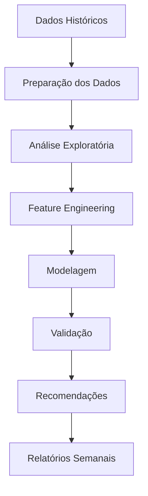
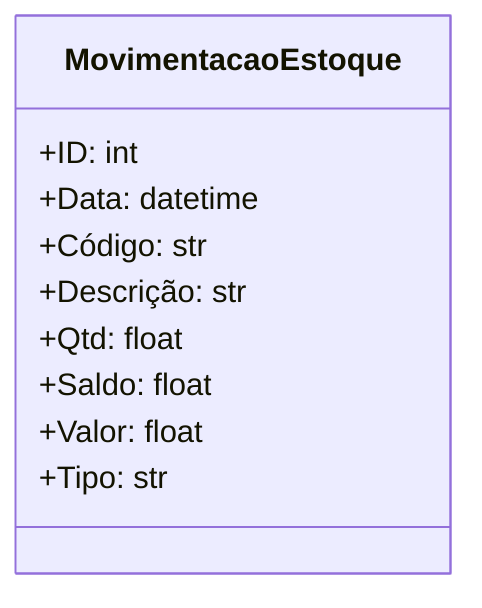

# Sistema de Recomendação de Estoque Mínimo para Supermercados

## 📋 Visão Geral

Este projeto implementa uma solução de Machine Learning para otimização de estoque em supermercados, utilizando dados históricos de vendas e movimentação para determinar o estoque mínimo ideal e gerar recomendações semanais de compras.

## 🎯 Objetivos

1. **Determinação de Estoque Mínimo Ideal**
   - Implementar modelo analítico para cálculo do estoque mínimo por produto
   - Considerar padrões históricos de venda, sazonalidade e movimentação
   - Otimizar níveis de estoque para minimizar custos e rupturas

2. **Recomendação Semanal de Compras**
   - Gerar lista automática de recomendações de compra
   - Baseado em estoque mínimo ideal e demandas esperadas
   - Reduzir carga manual e aumentar assertividade das decisões

## 🔍 Fluxo do Sistema

## 🛠️ Tecnologias Utilizadas

- Python 3.10+
- Bibliotecas Principais:
  - pandas: Manipulação de dados
  - scikit-learn: Modelos de Machine Learning
  - xgboost: Modelo de boosting
  - matplotlib/seaborn: Visualização de dados
  - psycopg2: Conexão com banco de dados PostgreSQL

## 📊 Estrutura do Dataset

O sistema utiliza dados de movimentação de estoque com as seguintes características principais:

## 🚀 Implementação

O projeto segue as seguintes etapas:

1. **Preparação dos Dados**
   - Limpeza e transformação
   - Feature engineering
   - Separação treino/teste

2. **Modelagem**
   - Seleção de features
   - Treinamento de modelos
   - Validação cruzada
   - Otimização de hiperparâmetros

3. **Recomendação**
   - Cálculo de estoque mínimo
   - Geração de recomendações
   - Relatórios semanais

## 📈 Métricas de Avaliação

- MAE (Mean Absolute Error)
- RMSE (Root Mean Squared Error)
- R² Score
- MAPE (Mean Absolute Percentage Error)

## 🔄 Premissas do Modelo

- Foco em operações de saída no PDV
- Cálculo de compra sugerida: `Compra Sugerida = Demanda Prevista − Saldo Atual`
- Consideração de sazonalidade e padrões históricos
- Exclusão de colunas irrelevantes para o modelo

## 📝 Licença

Este projeto está sob a licença MIT. Veja o arquivo [LICENSE](LICENSE) para mais detalhes.
