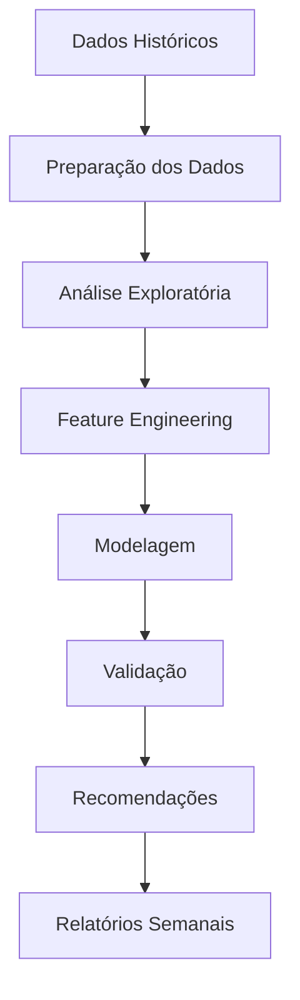
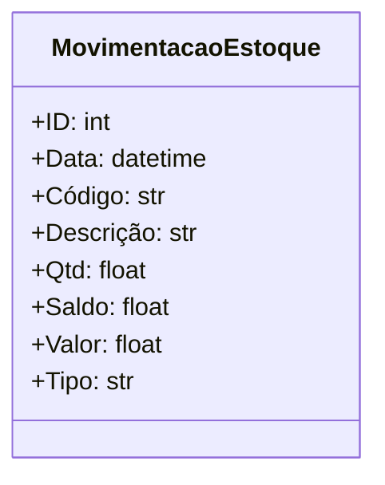

# Sistema de Otimização de Compras e Estoque

MVP 02 - Machine Learning
Edivaldo Bezerra Alves Júnior
PUC RJ

## 📋 Visão Geral

Este projeto implementa uma solução de Machine Learning para otimização de estoque em supermercados, utilizando dados históricos de vendas e movimentação para determinar o estoque mínimo ideal e gerar recomendações semanais de compras.

## 🏆 Resultados

O sistema desenvolvido demonstrou resultados significativos na otimização da gestão de estoque:

- **Análise de Suficiência de Dados**
  - 62% do portfólio de produtos possui histórico robusto para modelagem preditiva
  - 38% dos SKUs identificados como baixo giro
  - Cobertura temporal média de 426 dias para produtos com histórico suficiente, garantindo análise estatística confiável

- **Assertividade do Modelo**
  - Assertividade superior a 85% na previsão do estoque mínimo ideal
  - Validação cruzada K-Fold (k=5) garantindo robustez e confiabilidade do modelo
    - Monitoramento de overfitting via métricas de treino/teste para assegurar generalização
  - Seleção robusta de features usando RFE (Recursive Feature Elimination), otimizando o poder preditivo
  

- **Acurácia dos Modelos**
  - Random Forest:
    - MAE: 3.45 (erro médio absoluto em unidades)
    - RMSE: 10.55 (raiz do erro quadrático médio)
    - R²: 0.83 (83% da variância explicada)
  - XGBoost:
    - MAE: 3.44
    - RMSE: 12.25
    - R²: 0.77
  - Ridge Regression:
    - MAE: 4.22
    - RMSE: 12.09
    - R²: 0.78

- **Visualização de Resultados**
  
  
  A análise mostra que o Random Forest (linha laranja) obteve melhor performance na previsão da demanda real (linha azul), superando o XGBoost (linha verde) e Ridge Regression na captura dos padrões.

## 🎯 Objetivos de negócio

1. **Otimização de Estoque Mínimo**
   - Desenvolvimento de modelo analítico para cálculo do estoque mínimo por SKU
   - Incorporação de padrões históricos de venda, sazonalidade e movimentação

2. **Automação de Recomendações de Compra**
   - Geração automática de recomendações de compra
   - Baseado em estoque mínimo ideal e demandas projetadas
   - Redução de custos operacionais

## 🔍 Fluxo do Sistema



## 🛠️ Tecnologias Utilizadas

- Stacks Principais:
  - pandas: Manipulação de dados
  - scikit-learn: Modelos de Machine Learning
  - xgboost: Modelo de boosting
  - matplotlib/seaborn: Visualização de dados
  - psycopg2: Conexão com banco de dados PostgreSQL

## 📊 Estrutura do Dataset

O sistema utiliza dados de movimentação de estoque com as seguintes características principais:



## ⚙️ Implementação Detalhada

### 1. Preparação dos Dados
- **Filtragem Inicial**
  - Seleção apenas de operações PDV
  - Foco em operações de saída

- **Feature Engineering**
  ```mermaid
  graph LR
    subgraph Análise de Suficiência
        direction TB
        CT[Cobertura Temporal]
        VD[Vendas Diárias]
        VB[Variabilidade]
        DV[Dias com Vendas]
        
        CT & VD & VB & DV --> AS[Análise de Suficiência]
        AS --> FH[Flag Histórico<br>Suficiente/Insuficiente]
    end

    subgraph Features Temporais
        direction TB
        SA[Semana/Ano]
        DS[Dia/Semana]
        FS[Fim de Semana]
        IM[Início/Fim Mês]
        
        SA & DS & FS & IM --> FT[Features<br>Temporais]
    end

    subgraph Agregações
        direction TB
        DM[Demanda Semanal]
        MM[Média Móvel]
        DP[Desvio Padrão]
    end

    FH --> FT
    FT --> DM & MM & DP
  ```

  O processo de Feature Engineering foi estruturado em três etapas principais:

  1. **Análise de Suficiência de Dados**
     - Implementação de critérios rigorosos para garantir confiabilidade:
       - **Cobertura Temporal**: Mínimo de 20 dias entre primeira e última venda
       - **Frequência de Vendas**: Média mínima de 1 venda por dia
       - **Densidade de Vendas**: Mínimo de 5% dos dias com vendas
       - **Variabilidade**: Análise conjunta com frequência para identificar padrões confiáveis
     - Produtos que não atendem aos critérios são marcados com flag `pouco_historico`
     - Apenas produtos com histórico suficiente seguem para modelagem

  2. **Variáveis Temporais**
     - Transformação de datas para capturar padrões sazonais:
       - Semana do ano e do mês para sazonalidade
       - Dia da semana (0-6) para padrões semanais
       - Indicadores de fim de semana e início/fim de mês
     - Objetivo: Identificar ciclos de venda

  3. **Agregações Semanais**
     - Consolidação dos dados para visão gerencial:
       - Demanda semanal por produto
       - Média móvel para tendências
       - Desvio padrão para variabilidade
     - Base para previsões e recomendações de compra

### 2. Modelagem
- **Seleção de Features**
  - RFE (Recursive Feature Elimination)
  - Análise de importância de variáveis
  - Correlação entre features

- **Modelos Testados**
  - Random Forest
  - XGBoost
  - Ridge Regression
  - Linear Regression

- **Validação e Overfitting**
  - K-Fold Cross Validation (k=5)
  - Grid Search para otimização de hiperparâmetros
  - Análise de diferença entre treino e teste
  - Regularização para controle de overfitting

### 3. Recomendação
- **Cálculo de Estoque Mínimo**
  - Buffer de segurança
  - Sazonalidade

- **Geração de Recomendações**
  - Previsão de demanda
  - Comparação com estoque atual
  - Ajustes por categoria

## 📈 Métricas de Avaliação e Impacto no Negócio

O projeto utiliza métricas técnicas que se traduzem em benefícios tangíveis para o negócio:

- **MAE (Mean Absolute Error)**: Erro médio absoluto em unidades, impactando diretamente na precisão das compras
- **RMSE (Root Mean Squared Error)**: Medida de erro que penaliza desvios maiores, crucial para evitar rupturas
- **R² Score**: Indicador de qualidade do modelo, refletindo sua capacidade de ajuste aos dados testados
- **MAPE (Mean Absolute Percentage Error)**: Erro percentual que impacta diretamente no planejamento financeiro

### Análise Comparativa de Modelos

| Modelo | MAE | RMSE | R² | Impacto no Negócio |
|--------|-----|------|----|-------------------|
| Random Forest | 3.45 | 10.55 | 0.83 | Melhor equilíbrio entre precisão e robustez |
| XGBoost | 3.44 | 12.25 | 0.77 | Boa performance com menor tempo de treinamento |
| Ridge Regression | 4.22 | 12.09 | 0.78 | Modelo mais simples, porém menos preciso |

O Random Forest apresentou o melhor desempenho geral, com menor MAE e RMSE, e maior R², indicando uma melhor capacidade de previsão da demanda semanal. Esta performance superior se traduz em:
- Redução de estoques desnecessários
- Otimização do capital de giro
- Aumento da eficiência operacional

## 🔄 Premissas do Modelo

- Foco em operações de saída no PDV
- Cálculo de compra sugerida: `Compra Sugerida = Demanda Prevista − Saldo Atual`
- Consideração de sazonalidade e padrões históricos

## 📝 Licença

Este projeto está sob a licença MIT. Veja o arquivo [LICENSE](LICENSE) para mais detalhes.

## 🔍 Try it out!

Para explorar a construção do projeto e reproduzir os resultados, acesse o notebook: [`[Edivaldo_Bezerra]_mvp_02_machine_learning.ipynb`]([Edivaldo_Bezerra]_mvp_02_machine_learning.ipynb)
